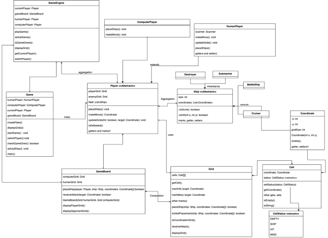

Battleship Game Description

Battleship is a classic strategic guessing game, traditionally for two players. It's played on grid-based boards where each player's fleet is hidden from the other's view. In our modernized single-player version, a human competes against an advanced AI computer opponent. The objective is to sink the opponent's fleet by deducing the ship placements on the grid.

Game Setup
•	Grid: Each player, human and computer, commands a 10x10 grid, labeled with rows 1-10 and columns A-J, serving as the battlefield for naval warfare.
•	Ships: Each fleet comprises various vessels, each occupying a distinct number of cells:
•	Battleship (4 cells)
•	Cruiser (3 cells)
•	Submarine (3 cells)
•	Destroyer (2 cells)
•	Placement: Vessels are strategically deployed onto the grid either horizontally or vertically, ensuring no overlaps or diagonal positioning, with each vessel occupying a set of consecutive squares proportionate to its size.

Gameplay Mechanics

•	Turns: Players alternately call out grid coordinates (e.g., A5, B3) to fire upon the opponent's fleet.
•	Hits and Misses: The opponent indicates "hit" or "miss" for each shot. Hits are marked on the attacker's tracking grid, and the defender marks their grid accordingly.
•	Sinking Ships: A ship is sunk when all its cells are hit, which should be announced by the opponent.
•	Tracking Shots: Keeping a record of all shots is essential for deducing the opponent's strategy and improving one's own targeting accuracy.
•	Game Continuity: The game continues in rounds until all of one player's ships are sunk.

Strategies

•	Ship Placement: Thoughtful ship placement can prevent quick detection. Strategies include distributing the fleet to minimize the chance of multiple ships being discovered simultaneously and using the edges and corners of the grid.
•	Guessing Strategy: Effective guessing relies on tracking hits and misses to identify the pattern of the remaining ships.
•	Pattern Analysis: Observing and adapting to the opponent's attack patterns can provide a strategic advantage.
•	Probability Mapping: Advanced players and the computer AI can use a probability map to determine the most likely grid cells an opponent's ships occupy, improving the accuracy of guesses.

Incorporating Strategies into the Game

To implement these strategies, especially for the ComputerPlayer class, we can incorporate algorithms that simulate these behaviors:
•	Random Placement with Constraints: The computer can place ships randomly but with constraints to avoid clustering and edge/corner preferences.
•	Hunt/Target Mode: After a hit, the computer can switch to "target mode," systematically firing at neighboring cells to sink the ship.
•	Shot Memory: The computer maintains a memory of past shots to avoid repeats and to use for probability mapping.
•	Probability Mapping Algorithm: The computer analyzes the grid to calculate the likelihood of ship placement in different cells, based on remaining ships and past moves.

Winning the Game

Victory is achieved by the first player to sink the entire fleet of the opponent.

Battleship Game Architecture

The GameBoard class centralizes the entire game state, encapsulating the grids of both the human and computer players. This enhancement streamlines the interaction between components and simplifies state management.
The Game class upholds a one-to-many relationship with the Player class, indicating that each game session includes multiple players—namely, one human and one computer player, fitting the single-player game paradigm. The Player class serves as an abstract base, defining shared attributes and actions for its subclasses, HumanPlayer and ComputerPlayer. These subclasses implement specific gameplay mechanics in line with their roles: HumanPlayer handles user interactions, while ComputerPlayer governs the AI behavior.
HumanPlayer and ComputerPlayer, as subclasses of Player, undertake the task of deploying their fleet of Ship objects onto their individual Grids and executing strategic moves during the gameplay.
The GameEngine class assumes responsibility for advancing the game, managing player turns, and adjudicating the outcomes. It collaborates closely with the Game class to enforce the rules and maintain the game's rhythm.
Within this architecture, the Grid class comprises numerous Cell objects, each corresponding to a unique coordinate on the battlefield. A Cell encapsulates a Coordinate—defining its position on the grid—and a CellStatus—designating whether it is vacant, occupied by a ship, or targeted by an attack. The Grid's composition of Cell objects implies ownership, with the Grid being accountable for the Cells' existence and lifecycle.
The abstract Ship class is employed by the Player class for the strategic placement of ships within the Grid, situated at designated Coordinates. This constitutes an association relationship, where Ship instances, while not a part of the Grid inherently, are managed by the Player.
The architectural design emphasizes both aggregation and composition principles. Aggregation is demonstrated in the bond between the Player and Ship entities, indicating a part-whole relationship sans strict ownership—players are in possession of ships, but ships maintain their independence from the players. In contrast, composition is clearly evidenced in the relation between the Grid and Cell objects, where Cells are an essential, non-independent component of the Grid.
By distinguishing the GameBoard class, the architecture achieves a distinct demarcation between the game state and game logic, the latter being the domain of the GameEngine.

1.	Game Class:
      •	Fields: HumanPlayer humanPlayer, ComputerPlayer computerPlayer, Player currentPlayer, GameBoard gameBoard.
      •	Methods: startGame(), switchPlayer(), checkGameOver(), setUpShips(), displayGrids(), createFleet(), main().
2.	GameBoard Class:
      •	Fields: Grid humanGrid, Grid computerGrid.
      •	Methods: placeShip(), receiveAttack(), displayPlayerGrid(), displayOpponentGrid().
3.	GameEngine Class: Similar to Game class but with a different implementation.
      •	Fields: Player humanPlayer, Player computerPlayer, GameBoard gameBoard, Player currentPlayer.
      •	Methods: playGame(), setUpGame(), isGameOver(), displayGrids(), getCurrentPlayer(), switchPlayer().
4.	Player Class (abstract):
      •	Fields: Grid playerGrid, Grid enemyGrid, List<Ship> fleet.
      •	Methods: getPlayerGrid(), getEnemyGrid(), getFleet(), placeShips(), makeMove(), isDefeated(), markHit(), markMiss(), markEmpty(), markShip(), markSunk(), isValidPlacement(), placeShip(), updateGrids().
5.	HumanPlayer Class: Extends Player.
      •	Fields: Scanner scanner.
      •	Methods: placeShips(), makeMove(), getScanner(), setScanner().
6.	ComputerPlayer Class: Extends Player.
      •	Methods: placeShips(), makeMove().
7.	Ship Class (abstract):
      •	Fields: int size, List<Coordinate> coordinates.
      •	Methods: getSize(), getCoordinates(), isSunk(), isHit(), markHit(), markSunk(), markEmpty(), markShip(), markMiss().
8.	Specific Ship Classes (Cruiser, Destroyer, Submarine, Battleship): Extend Ship class with similar structure.
9.	Grid Class:
      •	Fields: Cell[][] cells.
      •	Methods:), various methods for grid management like getCell(), markHit(), markMiss(), markSunk(), markEmpty(), markShip(), isValidPlacement(), placeShip(), isCoordinateInGrid(), receiveAttack(), displayGrid().
10.	Coordinate Class:
       •	Fields: int x, int y, int gridSize.
       •	Methods: Coordinate(int x, int y), isValid(), getX(), getY(), setX(), setY().
11.	Cell Class:
       •	Fields: Coordinate coordinate, CellStatus status.
       •	Methods: getCoordinate(), getStatus(), setStatus(), isEmpty(), isShip(), isHit(), isMiss(), isSunk(), markHit(), markMiss(), markSunk(), markEmpty(), markShip(), equals(), toString().
12.	CellStatus Enum: Defines possible states of a cell (EMPTY, SHIP, HIT, MISS, SUNK).

